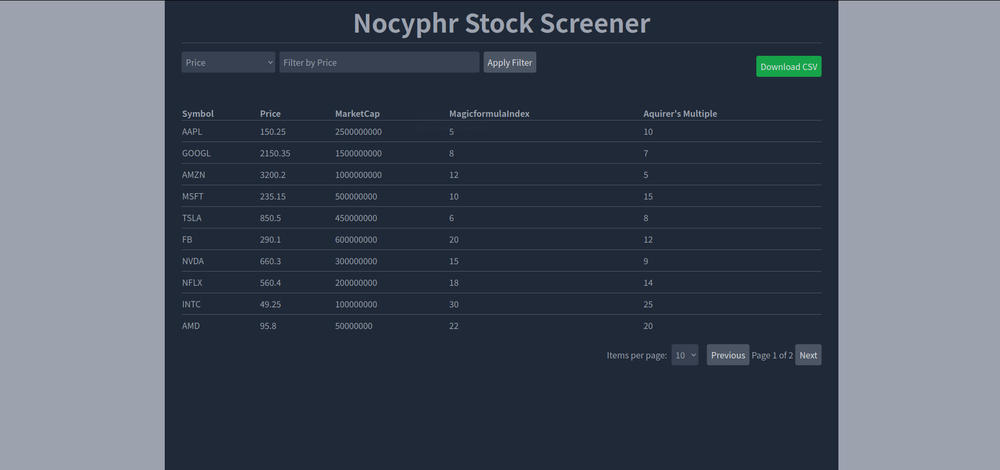

- [About](#about)
- [Features](#features)
- [Installation for development](#installation-for-development)
- [Running Tests](#running-tests)
- [Contributing](#contributing)
- [Work in Progress](#work-in-progress)
  - [Preparation](#preparation)
  - [Genesis](#genesis)
  - [Refactoring](#refactoring)
  - [Issues](#issues)


## About
A simple stock screener for `magic formula` and `aquirer's multiple` stocks. 

This Frontend is built using React - I am more of a python than a React-Programmer, so if someone, who uses this framework frequently and professionally, wants to improve on some things, feel free to [contribute](#contributing)

There is (or will be once I am done) a backend as well, which consists of a scraper, db and an api. I will create separate repositories for those though and the scraper might stay private to avoid a horde of people spamming the servers and getting the interfaces shut down. 



## Features

You can: 
- view
- filter
- sort
- download
a list of stocks according to your preferences

## Installation for development

To install the project, follow these steps:

1. Clone the repository:
```bash
git clone https://github.com/nocyphr/Screener.git
```
2. navigate to the directory
3. if you have installed docker and docker compose you can run
```bash
bash start_dev.sh
```
The rest happens on its own :D Magic of docker. If you do not know how to install docker please google `install docker <your_OS>` there will be a result at the top linking to the official docker documentation which gives you very detailed instructions on how to install docker and docker compose for your specific operating system. If you are on windows you will have to run the contents of the `start_dev.sh` file yourself in your terminal. 

## Running Tests
Open a terminal in the project folder and execute the following command: 
```bash
docker-compose -f ./misc/docker-compose.selenium up
``` 
Once selenium is running, open a new terminal and execute: 
```bash
bash run_tests.sh
```

This executes the gherkin step definitions and unit-tests

## Contributing

1. Fork the project repository
2. Create a new branch for your feature or bugfix: `git checkout -b my-feature-branch`
3. Commit your changes: `git commit -am 'Add new feature'`
4. Push your branch: `git push origin my-feature-branch`
5. Submit a pull request

## Work in Progress
### Preparation
- [x] write top level feature
- [x] write step definitions
- [x] setup basic docker(compose) structure
- [x] setup cucumber-js
- [x] setup selenium + webdriver
- [x] write a README

### Genesis
- [x] extend feature file for existence checks of elements?
- [x] Fill in the blank step definitions with actual tests
  - [x] title (h1) should be Nocyphr Stock Screener
  - [x] there is a table section
  - [x] there is data in the table
  - [x] there is a filter section
  - [x] sorting is possible and works
  - [x] filtering is possible and works
  - [x] getting the current table in csv format is possible (link? Download?)
- [x] styling? Frameworks? (bootstrap vs. tailwind)
- [x] refine Scenario: Filter stock data Outline with examples column | filter -> test text column, numerical column, operators
- [x] "remember" (cookie) applied sorting after page reload
- [ ] "remember" (cookie) applied filters after page reload 
- [ ] Add test for sequential filters

### Refactoring
- [x] use hooks directory and move code there to simplify components code
- [x] eliminate single helpers file (FilterLogic.js)
- [x] move logic from App.jsx to useFilter.js
- [ ] Create README 2.0

### Issues
- [x] Download button moves as filters are added instead of staying on the level of applyfilters button
- [ ] Go to page 2, set symbol filter to "A" -> you are on an empty page 2 because there are only enough items for one page
- [x] Sorting is lost in downloaded csv, only filters stay applied


find . -type f -exec sh -c 'echo -e "\n{}:" >> ../output.file; cat {} >> ../output.file' \;
